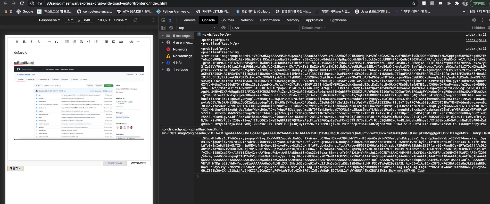

# 웹 텍스트 에디터를 이용하여 게시글 작성하기 (CRUD)

### 컨셉
- 웹 프론트에서는 텍스트 에디터를 활용하여 사용자가 텍스트를 작성할 수 있게 한다(스타일링 포함 & 위즈윅)
- 저 내용은 결국 html파일로 변환이 가능하니까. 토스트 에디터의 `getHtml()` 메소드를 활용하여 사용자가 입력한 내용을 html코드로 받는다.
- 이 때 에디팅할때 드래그앤 드롭으로 에디터에 이미지를 삽입했을 경우 `drop` 이벤트? 소스가 발생한것이고, 이 때 디폴트 동작은 base64인코딩인데 그게 아니라 특정 서버 리소스에 저장하는 js 코드로 훅을 달아줘야 할것 같다.
- 이렇게 되면 html코드와, img태그 안에는 특정 서버 URI가 담기게 되고, 이를 `API [POST]`로 자신이 만든 API서버에 날려버려서 DB에 저장하면 좋겠다고 생각이 든다.
- 받아올경우에도 토스트 UI에디터의 viewHtml() 같은 메서드를 활용해도 될 것 같고...

## 현재 상태



### 연구..

- toast UI editor에 이미지를 드롭하는 이벤트가 발생했을때
- base64인코딩이 아니라 특정 서버로 올리는 로직을 찾아보자..

- 현재 상태


- https://nhn.github.io/tui.editor/latest/addImageBlobHook
- 이거 참고해야 함

- 제출하는 이벤트가 발생했을때 완벽한 시나리오는 다음과 같음
    - 이미지를 드롭하여 에디터에 삽입했을때 우리가 원하는 특정 서버 URI로 저장되고, 바로 Img태그 안에 그 링크가 들어감
    - 이후 제출할때 getHtml() 메소드를 호출하고
    - 이 내용을 API 서버에 담아서 쑉 보내버리면 될듯


```js
'use strict'

//I thinks we can refer to https://solve-programming.tistory.com/29

const dummy_upload_image = (fileBlob) => {
    console.log(fileBlob)
    return "this is temp url!"
}

//결국 위 dummy_upload_umage(blob) 이 함수를 우리가 커스텀해서 특정 서버 URI로 저장하도록 코딩해야 함!

const editor = new toastui.Editor({
    el: document.querySelector('#editor'),
    height: '500px',
    initialEditType: 'wysiwyg',
    previewStyle: 'vertical',
    hooks: {
        addImageBlobHook: (blob, callback) => {
            const uploadedImageURL = dummy_upload_image(blob);
            callback(uploadedImageURL);
            return false;
        }
    }
});

const viewHtml = () => {
    console.log(editor.getHtml());
    //에디터 인스턴스의 getHtml() 메서드 호출하면 html 코드 받아 올 수 있네
    //그리고 이미지 업로드하면 base64인코딩되서 글안에 올라감
    // 이거 imageBlobHook이 있긴 있는데..
}

```

- addImageBlobHook을 활용하면 될듯, callback에 넣어줄 함수를 우리가 서버의 특정 URI로 저장하고, 그 URI를 리텀해주는 코드를 짜면 오키!